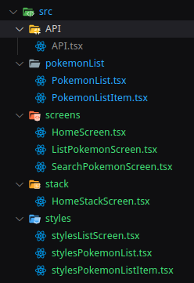

# Dojo-React-native

## Instalaciones requeridas

Se necesitaran para el realizar el proyecto en windows:

* Node: Se recomienda la version LTS de Node, link de descarga: [Node](https://nodejs.org/en/download)
* React Native command line interface.
* JDK.
* Android Studio.
  
React Native también requiere el kit de desarrollo Java SE (JDK) , que también se puede instalar con Chocolatey. Este puede se instalado
con el simbolo del sistema de administrador (Click derecho sobre el simbolo del sistema y seleccione "Ejecutar Adminitrador"), luego ejecute
el siguiente comando:

`choco install -y nodejs-lts microsoft-openjdk11`

## Instale el SDK de Android

Android Studio instala el último SDK de Android de forma predeterminada. Sin embargo, crear una aplicación React Native con código nativo requiere el Android 13 (Tiramisu)SDK en particular. Se pueden instalar SDK de Android adicionales a través del Administrador de SDK en Android Studio.

## Configure las variables de entorno ANDROID_HOME

Las herramientas React Native requieren la configuración de algunas variables de entorno para poder crear aplicaciones con código nativo.

1. Abra el Panel de control de Windows.
2. Haga clic en Cuentas de usuario, luego haga clic en Cuentas de usuario nuevamente
3. Haga clic en Cambiar mis variables de entorno
4. Haga clic en Nuevo... para crear una nueva ANDROID_HOMEvariable de usuario que apunte a la ruta a su SDK de Android:


El SDK se instala, de forma predeterminada, en la siguiente ubicación:

`%LOCALAPPDATA%\Android\Sdk`

## En caso de necesitar las intrucciones desde  la documentación oficial

[Configurar el entorno de desarrollo](https://reactnative.dev/docs/environment-setup?guide=native&os=windows)

---
---

# Iniciar poryecto

En una carpata donde quieras iniciar el proyecto realiza:

## Iniciar el proyecto con react native

```npx react-native@latest init NOMBRE_PROYECTO```

## [Opcional] Usar una versión o plantilla específica

`npx react-native@X.XX.X init AwesomeProject --version X.XX.X`
Luego de terminada la instalación con el comando **cd** "nombre de la carpeta" ingresar a la carpeta

## Dependencias

* `npm i expo-status-bar`

## Iniciar proyecto

En consola digita:

* `Code .` para abrir el **Visual estudio code**
* `npm start`
Luego de presionado el comando algo asi se despleagará en la consola:


Presionamos ***a*** para desplegar el emulador de *andriod*, luego de esperar un momento se debe desplegar una aplicacion
similar a esta:


En la raiz principal del proyecto crear la carpeta ***src***, y dentro de esta crear tres ***carpetas*** así:


Vamos a usar la api de pokemon [pokéAPI](https://pokeapi.co/)


En la carpeta ***api*** vamos crear el archivo **Api.tsx** asi:


En el archivo **Api.tsx** pondremos el siguiente código:

```JavaScript
import React,{
    useEffect,
    useState
    }           from 'react';

const pokePath              = "https://pokeapi.co/api/v2/";
// const pokeQuery             = "pokemon?limit=300&offset=0";
// const firstGenPokemonPath   = `${pokePath}${pokeQuery}`;

export function useFirstGenPokemons(page: number) {
    const [firstGenPokemonDetails, setFirstGenPokemonDetails]   = useState<any[]>([]);
    const limit                                                 = 50;
    const offset                                                = (page - 1) * limit;

    useEffect(() => {
        const fetchFirstGenPokemons = async () => {
            try {
                const pagePokemonPath               = `${pokePath}pokemon?limit=${limit}&offset=${offset}`;
                const firstGenPokemonIdsResponse    = await fetch(pagePokemonPath);

                if (!firstGenPokemonIdsResponse.ok) {
                    throw new Error('Error al obtener datos de la API');
                }
                
                const firstGenPokemonIdsBody    = await firstGenPokemonIdsResponse.json();
                const firstGenPokemonDetails    = await Promise.all(
                    firstGenPokemonIdsBody.results.map(async (p: { url: string }) => {
                        try {
                            const pDetailsResponse = await fetch(p.url);
                            if (!pDetailsResponse.ok) {
                                throw new Error('Error al obtener detalles del Pokémon');
                            }
                            return await pDetailsResponse.json();
                        } catch (error) {
                            console.error('Error al obtener detalles del Pokémon:', error);
                            return null;
                        }
                    })
                );
                setFirstGenPokemonDetails(firstGenPokemonDetails.filter((p) => p !== null));
            } catch (error) {
                console.error('Error al obtener datos de la API:', error);
            }
        };
        fetchFirstGenPokemons();
    }, [page]);
    return firstGenPokemonDetails;
}
```

Este archivo será el que nos conecta con la [Api](https://pokeapi.co/).

Inicialmente se pretendía listar todos los pokemon, sin embargo, esto afecta al rendimiento del dispositivo, por lo que la estructura ha cambiado considerablemente. Solo usaremos la variable ***pokePath***, que permitirá conectarnos a la API,  a través de fetch.

```javascript
const pokePath              = "https://pokeapi.co/api/v2/";
// const pokeQuery             = "pokemon?limit=300&offset=0";
// const firstGenPokemonPath   = `${pokePath}${pokeQuery}`;
```

Sirven para acotar la cantidad de respuestas que el api nos dará, es decir la cantidad de pokemones. Con ella tendremos la oportunidad de paginar y controlar la cantidad de pokemon que deseamos ver. Y la función ***useFirstGenPokemons*** se exporta para que pueda ser utilizada en otros componentes

```javascript
    const pagePokemonPath = `${pokePath}pokemon?limit=${limit}&offset=${offset}`;
```

---

## Algo sobre los hooks

 En el código se importaran los ***UseEffect*** y ***useState*** de react. Estos son hooks, y son usados para agregar capacidades de estado y otros comportamientos a componentes funcionales en lugar de componentes basados en clases. Los hooks permiten que los desarrolladores de React  puedan acceder a características de React como el estado, el ciclo de vida, y el contexto en componentes funcionales sin necesidad de crear clases.

* useState: Este hook permite a un componente funcional mantener y actualizar su estado local. Puedes usarlo para gestionar variables de estado en tus componentes sin necesidad de una clase.

* useEffect: Permite realizar efectos secundarios en componentes funcionales. Puedes usarlo para realizar tareas como suscripciones a eventos, llamadas a la API y actualizaciones del DOM cuando el componente se monta, actualiza o desmonta.

* useContext: Este hook permite acceder al contexto de la aplicación en componentes funcionales. Puedes utilizarlo para acceder a datos globales compartidos en tu aplicación.

* useRef: Te permite mantener una referencia mutable a un elemento del DOM o a un valor que persiste a lo largo de las renderizaciones del componente.

* Otros hooks personalizados: Puedes crear tus propios hooks personalizados para encapsular la lógica reutilizable y compartirla entre componentes funcionales.

---

Ahora la carpeta ***pokemonListItem*** crea mos el archivo **PokemonListItem.tsx** así:


En el archivo **PokemonListItem.tsx** empezaremos con las importaciones y posteriormente con los estilos que utilizaremos, así:

```javascript
import React    from 'react'
import {
    Image,
    StyleSheet,
    Text,
    View
}               from 'react-native'

const styles = StyleSheet.create({
    container: {
        backgroundColor : "lightgrey",
        marginTop   : 10
    },
    pokemonContainer: {
        fontSize    : 32,
        textAlign   : "center",
        marginTop   : 10
    },
    imageContainer: {
        width       : 200,
        height      : 200,
        alignSelf   : "center",
        borderRadius: 10,
        overflow    : 'hidden',
    },
    imageStyle: {
        flex        : 1,
        width       : undefined,
        height      : undefined,
    }
});
```

Posteriormente se definen tres propiedades un ***type***:

* id (número de identificación del Pokémon),
* name (nombre del Pokémon)
* sprites (que tiene una propiedad llamada front_default que contiene una URL de la imagen del Pokémon).

Estas quedarían de la siguiente forma:

```javascript
type Pokemon = {
    id      : number;
    name    : string;
    sprites : {
        front_default: string;
    };
};
```

Se define una interfaz llamada PokemonListItemProps que toma un objeto pokemon de tipo Pokemon.

```javascript
interface PokemonListItemProps {
    pokemon: Pokemon;
}
```

Finalmente definimos la función **PokemonListItem**:

```javascript
export function PokemonListItem({ pokemon } : PokemonListItemProps) {
    return (
        <View style={styles.container}>
            <Text style={styles.pokemonContainer}>
                {pokemon.id}.{pokemon.name.charAt(0).toUpperCase() + pokemon.name.slice(1)}
            </Text>

            <View style={styles.imageContainer}>
                <Image 
                    source  = {{uri: pokemon.sprites.front_default}}
                    style   = {styles.imageStyle}
                />
            </View>
        </View>
    );
}
```

el archivo completo quedaría asi:

```javascript
import React    from 'react'
import {
    Image,
    StyleSheet,
    Text,
    View
}               from 'react-native'

type Pokemon = {
    id      : number;
    name    : string;
    sprites : {
        front_default: string;
    };
};

interface PokemonListItemProps {
    pokemon: Pokemon;
}

export function PokemonListItem({ pokemon } : PokemonListItemProps) {
    return (
        <View style={styles.container}>
            <Text style={styles.pokemonContainer}>
                {pokemon.id}.{pokemon.name.charAt(0).toUpperCase() + pokemon.name.slice(1)}
            </Text>

            <View style={styles.imageContainer}>
                <Image 
                    source  = {{uri: pokemon.sprites.front_default}}
                    style   = {styles.imageStyle}
                />
            </View>
        </View>
    );
}

const styles = StyleSheet.create({
    container: {
        backgroundColor : "lightgrey",
        marginTop   : 10
    },
    pokemonContainer: {
        fontSize    : 32,
        textAlign   : "center",
        marginTop   : 10
    },
    imageContainer: {
        width       : 200,
        height      : 200,
        alignSelf   : "center",
        borderRadius: 10,
        overflow    : 'hidden',
    },
    imageStyle: {
        flex        : 1,
        width       : undefined,
        height      : undefined,
    }
});

```

---

Luego en la misma carpeta ***pokemonList*** creamos el archivo **PokemonList** así:


iniciamos con las siguientes importación:

```javascript
import React                from 'react';
import {
    FlatList,
    View,
    StyleSheet
    }                       from 'react-native';
import {PokemonListItem}    from './PokemonListItem';
```

Como en el archivo anterior definimos:

```javascript
type Pokemon = {
    id      : number;
    name    : string;
    sprites : {
        front_default: string;
    };
};

interface PokemonListProps {
    data: Pokemon[];
}
```

y los estilos que vamos a usar:

```javascript
const styles = StyleSheet.create({
    container: {
        flex            : 1,
        backgroundColor : 'grey',
        top             : 50,
        borderRadius    : 50
    },
    textSyle: {
        textAlign       : 'center'
    }
});
```

Y posteriormente se crea la funcion **PokemonList** que toma el objeto que devuelve el **api** y lo destructura como argumento **data** para poder mostrar los pokemon como una estructura de **react**.

```javascript
export function PokemonList({ data }: PokemonListProps) {
    return (
        <View style={styles.container}>
            <FlatList
                data        = {data.map((pokemon, index)    => ({ ...pokemon, id: index + 1 }))}
                keyExtractor= {(item)                       => item.id.toString()}
                renderItem  = {({ item })                   => <PokemonListItem pokemon={item} />}
            />
        </View>
    );
}
```

este sería el archivo final:

```javascript
// PokemonList.js - Componente para la lista de Pokémon
import React                from 'react';
import {
    FlatList,
    View,
    StyleSheet
    }                       from 'react-native';
import {PokemonListItem}    from './PokemonListItem';

type Pokemon = {
    id      : number;
    name    : string;
    sprites : {
        front_default: string;
    };
};

interface PokemonListProps {
    data: Pokemon[];
}

export function PokemonList({ data }: PokemonListProps) {
    return (
        <View style={styles.container}>
            <FlatList
                data        = {data.map((pokemon, index)    => ({ ...pokemon, id: index + 1 }))}
                keyExtractor= {(item)                       => item.id.toString()}
                renderItem  = {({ item })                   => <PokemonListItem pokemon={item} />}
            />
        </View>
    );
}


const styles = StyleSheet.create({
    container   : {
        flex            : 1,
        backgroundColor : 'grey',
        top             : 50,
        borderRadius    : 50
    },
    textSyle    : {
        textAlign       : 'center'
    }
});

```

---

Ahora en la carpeta ***mainComponent*** creamos el archivo **ListPockemonScreen.tsx**, así:


Igual que en los archivos anteriores empazamos con las importaciones:

```javascript
import React,{
    useState,
    }                           from 'react';
import {
    StyleSheet,
    Text,
    TouchableOpacity,
    View
    }                           from 'react-native';
import { useFirstGenPokemons }  from '../API/API';
import {PokemonList}            from '../pokemonList/PokemonList';

```

Y los estilos que usaremos:

```javascript
const styles = StyleSheet.create({
    container: {
        flex            : 1,
        justifyContent  : 'center',
        alignItems      : 'center',
        backgroundColor : 'black',
    },
    title: {
        fontSize        : 32,
        color           : 'black'
    },
})
```

Posteriormente, creamos la funcion **ListPockemonScreen()** que será la encargada de retornar los elementos de nuestra aplicación:

```javascript

export default function ListPokemonScreen() {
    const [currentPage, setCurrentPage] = useState(1);
    const data                          = useFirstGenPokemons(currentPage);

    const goToPreviousPage              = () => {
        if (currentPage > 1) {
            setCurrentPage(currentPage - 1);
        }
    };

    const goToNextPage                  = () => {
        if (data.length < 10) {
            return;
        }
        setCurrentPage(currentPage + 1);
    };
    
    console.log('useFirstGenPokemons', data);
    return (
        <View style={styles.container}>
            <View>
                <Text style         = {styles.title}>Primera Generación</Text>
                <Text style         = {styles.title}>Pockemon</Text>
            </View>
            <View  style={styles.secundaryContainer}>
                <PokemonList data={data} />
                <View style={styles.buttonContainer}>
                    <TouchableOpacity
                        style   = {styles.button}
                        onPress = {goToPreviousPage}
                    >
                        <Text style = {styles.textButton}>Atras</Text>
                    </TouchableOpacity>
                    <Text style = {styles.textButton}>{currentPage}</Text>
                    <TouchableOpacity
                        style   = {styles.button}
                        onPress = {goToNextPage}
                    >
                        <Text style = {styles.textButton}>Siguiente</Text>
                    </TouchableOpacity>
                </View>
            </View>
        </View>
    );
}


```

La linea: `console.log('firstGenPokemonDetails', firstGenPokemonDetails);` nos muestra en consola si la api nos está retornado información.

Finalmente el archivo completo se vería así:

```javascript
import React,{
    useState,
    }                           from 'react';
import {
    Text,
    TouchableOpacity,
    View
    }                           from 'react-native';
import { useFirstGenPokemons }  from '../API/API';
import {PokemonList}            from '../pokemonList/PokemonList';
import { stylesListScreen }     from '../styles/stylesListScreen';


export default function ListPokemonScreen() {
    const [currentPage, setCurrentPage] = useState(1);
    const data                          = useFirstGenPokemons(currentPage);

    const goToPreviousPage              = () => {
        if (currentPage > 1) {
            setCurrentPage(currentPage - 1);
        }
    };

    const goToNextPage                  = () => {
        if (data.length < 10) {
            return;
        }
        setCurrentPage(currentPage + 1);
    };
    
    console.log('useFirstGenPokemons', data);
    return (
        <View style={stylesListScreen.container}>
            <View style={stylesListScreen.secundaryContainer}>
                <Text style         = {stylesListScreen.title}>Primera Generación</Text>
                <Text style         = {stylesListScreen.title}>Pockemon</Text>
            </View>
            <View  >
                <PokemonList data={data} />
                <View style={stylesListScreen.buttonContainer}>
                    <TouchableOpacity
                        style   = {stylesListScreen.button}
                        onPress = {goToPreviousPage}
                    >
                        <Text style = {stylesListScreen.textButton}>Atras</Text>
                    </TouchableOpacity>
                    <Text style = {stylesListScreen.textButton}>{currentPage}</Text>
                    <TouchableOpacity
                        style   = {stylesListScreen.button}
                        onPress = {goToNextPage}
                    >
                        <Text style = {stylesListScreen.textButton}>Siguiente</Text>
                    </TouchableOpacity>
                </View>
            </View>
        </View>
    );
}

const styles = StyleSheet.create({
    container: {
        flex            : 1,
        justifyContent  : 'center',
        alignItems      : 'center',
        backgroundColor : 'black',
    },
    secundaryContainer: {
        flexDirection   : 'column',
        justifyContent  : 'center',
        marginbutton    : 50,
    },
    buttonContainer: {
        flexDirection   : 'row',
        justifyContent  : 'space-between',
        alignItems      : 'center',
    },
    button:{
        backgroundColor: 'blue',
        padding         : 10,
        margin          : 50,
        borderRadius    : 30,
        shadowRadius    : 10,
    },
    textButton:{
        color           : 'white',
        fontWeight      : 'bold',
        textAlign       : 'center',
        textTransform   : 'uppercase',
    },
    title: {
        fontSize        : 32,
        fontWeight      : 'bold',
        textAlign       : 'center',
        color           : 'white',
    },
})
```

---

Si vamos al simulador esta será la vista que tendremos:


esto porque el archivo de entrada de la aplicación **App.tsx** no se ha modificado, debemos borrar su contenido y poner el siguiente codigo:

```javascript
import React from 'react'
import ListPokemonScreen from './src/mainComponent/ListPokemonScreen';

export default function App() {
return (
    <ListPokemonScreen />
)
}
```

El resultado puede tardar un poco, en caso no verse un cambio podemos tipear la tecla **r** para realizar la acción de ***reload the app***. El resultado final es este:


---
---

## Organizando un poco nuestro codigo
Empezaremos renombrando la carpeta que teniamos nombrada como **mainComponent** a **screens**, por el momento solo tendremos en esta carpeta el archivo **ListPokemonScreen.tsx**:


Una practica recomendada, cuando se esta desarrollando en React Native, es tener separados los componentes de codigo que se encarga de la estilización, esto ayuda a mejorar el rendimiento, realizar reutilización de codigo, mejora la legibilidad y permite evitar los errores.

A continuación crearemos dentro de la carpeta ./src una carpeta llamada styles. y dentro de esta misma cree los siguientes archivos:

* StylesListScreen.tsx
* StylesPokemonList.tsx
* StylesPokemonListItmen.tsx



A continuación se explicara como haremos el cambio en uno de los archivos (ListPokemonScreen.tsx), luego, debes replicar el mismo procedimineto para los otros dos archivos.

1. Vamos a cambar el nombre a cada uno de los objetos que se encargan de la estilización de cada componente, para ello entramos al componente ListPockemonScreen.tsx,

2. Señale el objeto que se encarga del estilizado, ubicado en la parte inferior del archivo.  y presione la tecla F2, y cambie el nombre, se recomienda el nombre **StylesListScreen** . El anterior, procedimiento cambiará el nombre a todas las instancias que estan utilizando el objeto para estilizar.

3. Seleccione todo el objeto cortelo y peguelo dentro de stylesPokemonScreen, luego resuelva las importaciones.

4. Finalmente vuelva al componente LisPokemonScren.tsx y resuelva las importaciones relacionadas con el nuevo archivo que acaba de crear.

Ahora creemos una carpeta llamada screen. En ella vamos a colocar las pantallas que serán visibles en nuestro dispositivo. en este caso pondremos dentro de la carpeta los archivos:

* ListPokemonScreen.tsx     (ya la teniamos)
* HomeScreen.tsx            (es nueva)
* SearchPokemonScreen.tsx   (es nueva)

Si estas trabajando en el editor de codigo Visual Studio Code, este se encargara por nosotros, de cambiar las importaciones en los archivos que utilizan estas pantallas

---
---

## Implementando la navegación de React Native

En react native hay varias formas de implementar la navegación entre las pantallas: Se pueden crear botones en una pantalla determinada para navegar a otras pantallas, también es posible crear pestañas que permita moverse entre pantallas, o un menu lateral que contanga botones y direcciones a otras pantallas. Para esta aplicación utilizaremos la primera, y para ello utilizaremos el componente stackNavigation de react native. A continuación es impresindible instalar las siguientes librerias en tu proyecto:

1. npm install @react-navigation/native
2. npm install @react-navigation/native-stack
3. npm install react-native-safe-area-context
4. npm install react-native-screens
5. npm install axios

En la ruta:
**android/app/src/main/java/nombre_de_tu_proyecto/MainActivity.java**


agrega el siguiente codigo dentro del cuerpo de la clase MainActivity:

```java
  // ...
  @Override
  protected void onCreate(Bundle savedInstanceState) {
    super.onCreate(null);
  }
  // ...
```

Creemos una carpeta llamada stacks dentro de src, dentro de ella, creamos el archivo HomeStackScreen.tsx
El archivo completo quedaría de la siguiente forma:

```javascript
//HomeStackScreen.tsx
import React                            from "react";
import ListPokemonScreen                from "../screens/ListPokemonScreen";
import { SearchPokemonScreen }          from "../screens/SearchPokemonScreen";
import { HomeScreen }                   from "../screens/HomeScreen";
import { createNativeStackNavigator }   from "@react-navigation/native-stack";

const Stack = createNativeStackNavigator();

export const HomeStackScreen = () => {
    return (
            <Stack.Navigator
                initialRouteName  = "Inicio"            
            >
                <Stack.Screen 
                    name = "Inicio"
                    component = {HomeScreen} 
                />
                <Stack.Screen 
                    name = "ListPokemonScreen"
                    component = {ListPokemonScreen} 
                />
                <Stack.Screen 
                    name = "SearchPokemonScreen"
                    component = {SearchPokemonScreen}
                />
            </Stack.Navigator>

    );
};
```

Si se analiza con detalle el codigo de HomeStackScreen, alli estamos relacionando 3 pantallas:

* Una pantalla de inicio                        (HomeScreen.tsx)
* Una pantalla donde listamos todos los pokemon (ListPokemonScreen.tsx)
* Una pantalla donde podemos buscar por pokemon (SearchPokemonScreen.tsx)

---
Vamos a crear nuestra pantalla de inicio HomeScreen.tsx, para ello creamos dentro de src la carpeta screens:

```javascript
//HomeScreen.tsx
import React,{
    }                               from 'react';
import {
    Text, 
    TouchableOpacity, 
    View, 
    }                               from 'react-native';
import { NativeStackScreenProps }   from '@react-navigation/native-stack';
import { stylesListScreen }         from '../styles/stylesListScreen';

interface Props extends NativeStackScreenProps<any, any> { }

export const HomeScreen = ({navigation }: Props) => {

    return (
        <View style = {stylesListScreen.container}>
            <Text style         = {stylesListScreen.title}>Pantalla Principal</Text>
            <View style = {stylesListScreen.buttonContainer}>
                <TouchableOpacity
                        style   = {stylesListScreen.button}
                        onPress = {() => navigation.navigate('ListPokemonScreen')}
                    >
                    <Text style = {stylesListScreen.textButton}>Lista Pokemon</Text>
                </TouchableOpacity>
                <TouchableOpacity
                    style       = {stylesListScreen.button}
                    onPress     = {() => navigation.navigate('SearchPokemonScreen')}
                >
                    <Text style = {stylesListScreen.textButton}>Buscar Pokemon</Text>
                </TouchableOpacity>
            </View>
        </View>
    );
}
```

Si observamos bien en los componente donde se llama la opción de style; se esta reutilizando el código stylesListScreen, por lo que nos estamos ahorrando algúnas líneas de código.

La pantalla de HomeScreen debe quedar aproximadamente de la siguiente forma:


Ahora vamos a modificar la componente App.tsx, quien es el que primero se llama a renderizar, por ello direccionamos a nuestro componente acabado de construir HomeStackScreen.tsx, quien se encargara de encolar las diferentes pantallas que manejemos dentro de nuestra aplicación.

```javascript
//app.tsx
import React                    from 'react'
import { HomeStackScreen }      from './src/stack/HomeStackScreen';
import { NavigationContainer }  from '@react-navigation/native';

export default function App() {
return (
    <NavigationContainer>
        <HomeStackScreen />
    </NavigationContainer> 

    )   
}
```

---
Ahora modifiquemos un poco nuestra ListPockemonScreen.tsx, tanto para reorganizar un poco sus elementos, como para habilitar la propiedad de navegación:

```javascript
//ListPockemonScreen.tsx
import React,{
    useState,
    }                               from 'react';
import {
    Text,
    TouchableOpacity,
    View
    }                               from 'react-native';
import { useFirstGenPokemons }      from '../API/API';
import {PokemonList}                from '../pokemonList/PokemonList';
import { stylesListScreen }         from '../styles/stylesListScreen';
import { NativeStackScreenProps }   from '@react-navigation/native-stack';
// import { StackScreenProps } from '@react-navigation/stack';

// interface Props extends StackScreenProps<any, any> { }
interface Props extends NativeStackScreenProps<any, any> { }


export default function ListPokemonScreen({navigation }: Props) {
    const [currentPage, setCurrentPage] = useState(1);
    const data                          = useFirstGenPokemons(currentPage);

    const goToPreviousPage              = () => {
        if (currentPage > 1) {
            setCurrentPage(currentPage - 1);
        }
    };

    const goToNextPage                  = () => {
        if (data.length < 10) {
            return;
        }
        setCurrentPage(currentPage + 1);
    };
    
    console.log('useFirstGenPokemons', data);
    return (
        <View style = {stylesListScreen.container}>
            <View  >
                <View style = {stylesListScreen.secundaryContainer}>
                    <Text style = {stylesListScreen.title}>Primera Generación</Text>
                    <Text style = {stylesListScreen.title}>Pokemon</Text>
                </View>
                <View  style = {stylesListScreen.buttonContainer}>
                <TouchableOpacity
                        style   = {stylesListScreen.button}
                        onPress = {goToPreviousPage}
                    >
                        <Text style = {stylesListScreen.textButton}>Pag. Anterior</Text>
                    </TouchableOpacity>
                    <Text style = {stylesListScreen.textButton}>{currentPage}</Text>
                    <TouchableOpacity
                        style   = {stylesListScreen.button}
                        onPress = {goToNextPage}
                    >
                        <Text style = {stylesListScreen.textButton}>Pag. Siguiente</Text>
                    </TouchableOpacity>
                </View>
                <PokemonList data={data} />
                <View>
                    <TouchableOpacity
                        style   = {stylesListScreen.button}
                        onPress = {() => navigation.goBack()}
                    >
                        <Text style = {stylesListScreen.textButton}>Atras</Text>
                    </TouchableOpacity>

                </View>
            </View>
        </View>
    );
}

```

---

Ahora creemos nuestro vista de busqueda de Pokemon, primero creemos dentro de nuestra carpeta styles el archivo que llamaremos stylesDimension.tsx, este se encargara del calculo de las dimensiones del dispositivo:

```javascript
import { Dimensions } from "react-native";

let {height}            = Dimensions.get('window');
let box_count           = 1 || 2 || 3;
export const box_height = height / box_count;
```

agreguemos algunas propiedades a stylesListScreen.tsx, teniendo en cuuenta el archivo anteriormente creado, y otras propiedades que utilizaremos en nuestro buscador de Pokémon:

```javascript
//stylesListScreen.tsx
import { StyleSheet } from "react-native";
import { box_height } from "./stylesDimension";
import { Colors } from "react-native/Libraries/NewAppScreen";

export const stylesListScreen = StyleSheet.create({
    container: {
        flex            : 1,
        justifyContent  : 'center',
        alignItems      : 'center',
        backgroundColor : 'black',
    },
    secundaryContainer: {
        flexDirection   : 'column',
        marginbutton    : 5,
    },
    box: {
        height: box_height,
    },
    boxBody : {
        flex            : 1,
        justifyContent  : 'center',
    },
    buttonContainer: {
        flexDirection   : 'row',
        justifyContent  : 'space-evenly',
        alignItems      : 'center',
    },
    button:{
        backgroundColor: 'blue',
        padding         : 5,
        margin          : 50,
        borderRadius    : 30,
        shadowRadius    : 5,
    },
    textButton:{
        color           : 'white',
        fontWeight      : 'bold',
        textAlign       : 'center',
        textTransform   : 'uppercase',
    },
    title: {
        fontSize        : 35,
        fontWeight      : 'bold',
        textAlign       : 'center',
        color           : 'white',
    },
    labelScreen                 : {
        color             : 'white',
        fontWeight        : '600',
        fontSize          : 20,
        marginTop         : 10,
        marginLeft        : 20,
        marginRight       : 20,
    },
    textInput                   : {
        color             : Colors.dark,
        backgroundColor   : 'white',
        fontSize          : 18,
        marginTop         : 10,
        marginLeft        : 10,
        marginRight       : 10,
        marginBottom      : 10,
        fontWeight        : '600',
        paddingLeft       : 15,
        borderWidth       : 1,
        borderRadius      : 10,
        borderColor       : Colors.black,
        paddingRight      : 10,
    },
})
```

y nuestro archivo de busqueda SearchPokemonScreen.tsx quedaría de la siguiente forma:

```javascript
import React,{
    useState,
    }                               from "react";
import {
    View,
    Text,
    Image,
    TextInput,
    TouchableOpacity,
    ScrollView,
    }                               from "react-native";
import axios                        from "axios";
import { NativeStackScreenProps }   from "@react-navigation/native-stack";
import { stylesListScreen }         from "../styles/stylesListScreen";

// interface Props extends StackScreenProps<any, any> { }
interface Props extends NativeStackScreenProps<any, any> { }

export const SearchPokemonScreen = ({navigation }: Props) => {
    const [searchTerm, setSearchTerm]   = useState('');
    const [pokemonData, setPokemonData] = useState<any>(null);

    const searchPokemon = async () => {
        try {
            const response = await axios.get(`https://pokeapi.co/api/v2/pokemon/${searchTerm}`);
            setPokemonData(response.data);
        } catch (error) {
            console.error(error);
            setPokemonData(null);
        }
    };

    return(
        <View style   = {stylesListScreen.container}>
            <View style={[stylesListScreen.box, stylesListScreen.boxBody]}>
                <View>
                    <Text style={stylesListScreen.title}>Buscar Pokemon</Text>
                </View>
                <TextInput
                    style       =   {stylesListScreen.textInput}
                    placeholder = "Nombre del Pokémon"
                    value       = {searchTerm}
                    onChangeText= {(text) => setSearchTerm(text.toLowerCase())}
                />
                <TouchableOpacity
                    style       = {stylesListScreen.button}
                    onPress     = {searchPokemon}
                >
                    <Text style = {stylesListScreen.textButton}>Buscar</Text>
                </TouchableOpacity>
                {pokemonData && (
                    <ScrollView  style = {stylesListScreen.secundaryContainer}>
                        <Text style = {stylesListScreen.labelScreen}>  Nombre: {pokemonData.name}</Text>
                        <Image
                            source  = {{ uri: pokemonData.sprites.front_default }}
                            style   = {{ width: 300, height: 300 }}
                        />
                        <Text style = {stylesListScreen.labelScreen}>Experiencia Base: {pokemonData.base_experience}</Text>
                        <Text  style = {stylesListScreen.labelScreen}>Habilidades:</Text>
                            {pokemonData.abilities.map((ability: any) => (
                                <Text  style = {stylesListScreen.labelScreen} key={ability.ability.name}>{ability.ability.name}</Text>
                            ))}
                    </ScrollView>
                )}
            </View>
            <TouchableOpacity
                style   = {stylesListScreen.button}
                onPress = {() => navigation.goBack()}
            >
                <Text style = {stylesListScreen.textButton}>Atras</Text>
            </TouchableOpacity>
        </View>
        )
}
```
